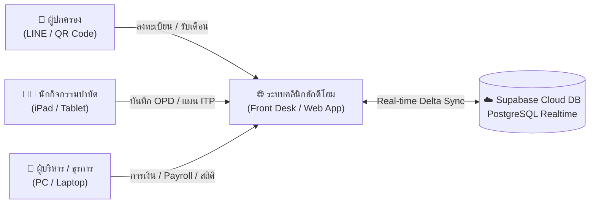
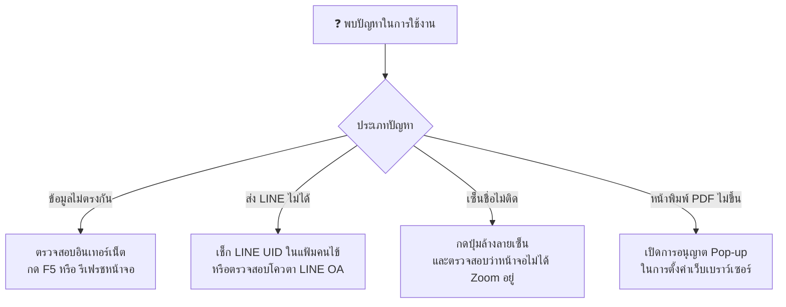

# คู่มือการใช้งานระบบบริหารจัดการคลินิกกิจกรรมบำบัด ฮักดีโฮม
## Hug Dee Home Clinic Information System (HDH-CIS) — Official User Manual (ฉบับแสดงภาพหน้าจอจริง)

> [!NOTE]
> **เวอร์ชันระบบ:** 2026.10 (Full Real-Time Delta Sync Edition)  
> 📄 **ไฟล์เอกสาร Microsoft Word (.docx):** [คลิกเปิดไฟล์ Word (3.65 MB)](file:///C:/Users/Asus/.gemini/antigravity/scratch/hug-dee-home/คู่มือการใช้งานระบบ_HugDeeHome_Clinic.docx)  
> 📑 **ไฟล์เอกสาร PDF พร้อมภาพจริงในตัว (.pdf):** [คลิกเปิดไฟล์ PDF (4.14 MB)](file:///C:/Users/Asus/.gemini/antigravity/scratch/hug-dee-home/คู่มือการใช้งานระบบ_HugDeeHome_Clinic.pdf)  
> 💡 *หมายเหตุสำหรับการเปิดไฟล์ Word (.docx): กรุณาเปิดด้วยโปรแกรม Microsoft Word หรือ WPS Office ใน Windows โดยตรง (หลีกเลี่ยงการเปิดดูผ่าน text viewer ของโปรแกรมเขียนโค้ดเพื่อให้อ่านฟอนต์ภาษาไทยและรูปภาพได้คมชัด 100%)*

---

*ภาพที่ 1: ภาพรวมศูนย์บริการกิจกรรมบำบัดและระบบบริหารจัดการข้อมูลคลินิก ฮักดีโฮม (Hug Dee Home Clinic)*

---

## 📌 สารบัญหลัก (Table of Contents)
1. [บทนำและสถาปัตยกรรมระบบ (System Overview & Architecture)](#บทนำและสถาปัตยกรรมระบบ)
2. [ตารางแจกแจงสิทธิ์การใช้งานตามบทบาท (Role-Based Access Matrix)](#ตารางแจกแจงสิทธิ์การใช้งานตามบทบาท)
3. [บทที่ 1: แถบเมนูนำทางหลักและโครงสร้างระบบ (Navigation & Sidebar Layout)](#บทที่-1-แถบเมนูนำทางหลักและโครงสร้างระบบ)
4. [บทที่ 2: ขั้นตอนการลงทะเบียนผู้รับบริการ และหน้าต่าง Modal กรอกข้อมูล (Patient Intake)](#บทที่-2-ขั้นตอนการลงทะเบียนผู้รับบริการ)
5. [บทที่ 3: ระบบลงทะเบียนสำหรับผู้ปกครอง และระบบเซ็นชื่อดิจิทัลสด (Parent Portal & Signature Pad)](#บทที่-3-ระบบลงทะเบียนสำหรับผู้ปกครอง)
6. [บทที่ 4: ตารางนัดหมายและระบบส่ง LINE เตือนล่วงหน้าแบบกลุ่ม (Batch LINE Reminders)](#บทที่-4-ตารางนัดหมายและระบบส่ง-line-เตือนล่วงหน้าแบบกลุ่ม)
7. [บทที่ 5: คู่มือสำหรับนักกิจกรรมบำบัด (OT Guide - ITP & Home Program)](#บทที่-5-คู่มือสำหรับนักกิจกรรมบำบัด)
8. [บทที่ 6: คู่มือสำหรับผู้บริหารและฝ่ายบัญชี (Admin & Executive Guide)](#บทที่-6-คู่มือสำหรับผู้บริหารและฝ่ายบัญชี)
9. [คำถามที่พบบ่อยและการแก้ปัญหาเบื้องต้น (FAQ & Troubleshooting)](#คำถามที่พบบ่อยและการแก้ปัญหาเบื้องต้น)

---

## บทนำและสถาปัตยกรรมระบบ
ระบบบริหารจัดการคลินิกกิจกรรมบำบัด **ฮักดีโฮม (Hug Dee Home Clinic Information System)** พัฒนาขึ้นด้วยเทคโนโลยีเว็บแอปพลิเคชันสมัยใหม่ ทำงานด้วยสถาปัตยกรรม **Hybrid Real-Time Delta Sync** ซึ่งมีจุดเด่นสำคัญดังนี้:

* **Real-time Sync ทุกอุปกรณ์:** ทุกเครื่องที่เปิดใช้งานระบบ (คอมพิวเตอร์หน้าเคาน์เตอร์, แท็บเล็ต iPad ของนักบำบัดในห้องตรวจ, หรือสมาร์ทโฟนของผู้บริหาร) จะอัปเดตข้อมูลตรงกันทันทีแบบเสี้ยววินาทีผ่าน Supabase PostgreSQL Cloud
* **Offline-Resilient LocalStorage:** มีการแคชข้อมูลลงฐานข้อมูลเบราว์เซอร์ ช่วยให้เปิดหน้าจอได้เร็ว โหลดข้อมูลทันที และปลอดภัยเมื่อเกิดเหตุขัดข้องทางสัญญาณอินเทอร์เน็ต
* **Responsive Touch-First Design:** หน้าจอถูกจัดวางให้เหมาะกับการใช้งานด้วยนิ้วสัมผัสและปากกาสไตลัสบนแท็บเล็ต iPad สะดวกต่อการพกพาไปประเมินเด็กในห้องกิจกรรม

---

## ตารางแจกแจงสิทธิ์การใช้งานตามบทบาท

| ความสามารถของระบบ | ผู้ปกครอง (Parent) | ธุรการ/ต้อนรับ (Staff) | นักบำบัด (OT) | ผู้บริหาร (Admin) |
| :--- | :---: | :---: | :---: | :---: |
| **ลงทะเบียนประวัติผู้รับบริการ** | ✔ (ผ่าน QR/ลิงก์) | ✔ เต็มรูปแบบ | ✔ ดู/แก้ไขประวัติ | ✔ จัดการทั้งหมด |
| **เซ็นชื่อดิจิทัลรับทราบนโยบาย** | ✔ หน้าจอสัมผัส/ปากกา | ✔ ตรวจสอบ | ✔ ตรวจสอบในเวชระเบียน | ✔ ดูแลความปลอดภัย |
| **ปฏิทินนัดหมาย & ส่ง LINE เตือนกลุ่ม** | ✖ (รับแจ้งเตือน) | ✔ จัดการคิว & ส่งกลุ่ม | ✔ ดูตารางงานตนเอง | ✔ จัดการได้ทุกตาราง |
| **ประเมินพัฒนาการ (DSPM / Sensory)** | ✖ (รับรายงานสรุป) | ✖ | ✔ ประเมิน & แปลผล | ✔ จัดการเทมเพลต |
| **แผนบำบัดรายบุคคล (ITP Tracker)** | ✖ (รับรายงานความก้าวหน้า) | ✖ | ✔ ตั้งเป้า & ปรับ % | ✔ ดูรายงานรวมคลินิก |
| **บันทึกเวชระเบียน (OPD SOAP Note)** | ✖ | ✖ | ✔ บันทึกทุก Session | ✔ ตรวจสอบมาตรฐาน |
| **ชุดกิจกรรมฝึกที่บ้าน (Home Program)** | ✔ รับการ์ด PDF & LINE | ✖ | ✔ ออกแบบ & สั่งพิมพ์ | ✔ ตรวจสอบและดูภาพรวม |
| **ออกใบเสร็จรับเงิน & ตัดคอร์ส** | ✖ (รับใบเสร็จ) | ✔ เปิดบิล & ตัดคอร์ส | ✖ (ดูประวัติการเข้า) | ✔ ดูแลนโยบายราคา |
| **ติดตามคนไข้ขาดการติดต่อ (Retention)** | ✖ | ✔ โทรตาม & บันทึก Note | ✔ ดูประวัติเคสตนเอง | ✔ วิเคราะห์อัตรา Retention |
| **คำนวณเงินเดือน ค่าเวร และค่าคอม** | ✖ | ✖ | ✖ (ดูสลิปตนเอง) | ✔ คำนวณ & จัดการเต็มระบบ |

---

## บทที่ 1: แถบเมนูนำทางหลักและโครงสร้างระบบ
ระบบคลินิก ฮักดีโฮม จัดวางเมนูการใช้งานไว้ทาง **แถบด้านซ้าย (Sidebar)** อย่างเป็นหมวดหมู่ เมื่อคลิกที่เมนูใด หน้าจอหลักจะสลับไปแสดงเนื้อหานั้นทันที:

*ภาพหน้าจอจริงที่ 1: หน้าหลักแดชบอร์ด (Dashboard) พร้อมโครงสร้างแถบเมนูด้านซ้าย*  
👉 **ตำแหน่งแถบเมนู:** คลิกแถบเมนู **"หน้าหลัก"** ด้านบนสุด เพื่อดูภาพรวมเคสวันนี้ สถิติคอร์สคงเหลือ และสถานะคลาวด์

### โครงสร้างเมนูในแถบด้านซ้าย (Sidebar):
* **หมวดการจัดการผู้รับบริการ:**
  * **"ทะเบียนประวัติ"** (จัดการข้อมูลคนไข้, เปิด HN ใหม่, พิมพ์ประวัติเวชระเบียน)
  * **"ตารางนัดหมาย"** (ปฏิทินนัดหมาย, ดูคิวนักบำบัด และระบบส่ง LINE เตือนแบบกลุ่ม)
  * **"คอร์สลูกค้า"** (เช็กจำนวนครั้งคงเหลือ และประวัติการใช้งานคอร์ส)
* **หมวดพัฒนาการและการประเมิน:**
  * **"ประเมินพัฒนาการ"** (แบบประเมิน DSPM, Sensory Profile, Denver II)
  * **"เป้าหมาย ITP"** (แผนการบำบัดฟื้นฟูรายบุคคล Milestone Tracker)
  * **"บันทึกผลการฝึก"** (บันทึกเวชระเบียน OPD SOAP Note และชุด Home Program)
  * **"หนังสือส่งตัว"** (ออกเอกสารส่งต่อไปยังแพทย์หรือโรงเรียน)
* **หมวดการเงินและบริการ:**
  * **"ออกใบเสร็จ"** (ระบบ POS คิดเงิน ออกใบเสร็จรับเงิน และตัดยอดคอร์ส)
  * **"ประวัติใบเสร็จ"** (ตรวจสอบยอดขายย้อนหลัง และพิมพ์ใบเสร็จซ้ำ)
* **สถานะออนไลน์ด้านบนขวา:**
  * แสดงปุ่ม **"ออนไลน์ (คลาวด์ปกติ)"** สีเขียว หากเน็ตหลุดจะเปลี่ยนเป็นสถานะออฟไลน์อัตโนมัติ และซิงค์ขึ้นคลาวด์เมื่อเน็ตกลับมา

---

## บทที่ 2: ขั้นตอนการลงทะเบียนผู้รับบริการ
สำหรับเจ้าหน้าที่ธุรการและฝ่ายต้อนรับ การเพิ่มประวัติผู้รับบริการรายใหม่สามารถทำได้ผ่านหน้าต่าง Modal ที่ถูกออกแบบให้กระชับและครบถ้วน:

*ภาพหน้าจอจริงที่ 2: หน้าต่าง Modal "ลงทะเบียนรายใหม่" พร้อมช่องกรอกข้อมูลครบถ้วน*  
👉 **ขั้นตอนการเปิด:** แถบด้านซ้ายคลิก **"ทะเบียนประวัติ"** $\rightarrow$ ด้านบนขวาคลิกปุ่มสีน้ำเงิน **"+ ลงทะเบียนรายใหม่"**

### รายละเอียดช่องกรอกข้อมูลในหน้าต่าง Modal:
1. **HN (รันอัตโนมัติ):** ระบบสร้างรหัสประจำตัวผู้ป่วยให้อัตโนมัติ เช่น 69055 โดยไม่ต้องพิมพ์เอง
2. **สถานะ:** เลือก "Active" สำหรับผู้รับบริการที่มาบำบัดต่อเนื่อง
3. **เพศ และ คำนำหน้าชื่อ:** ชาย/หญิง (เด็กชาย, เด็กหญิง, นาย, นางสาว)
4. **ชื่อ-นามสกุล และ ชื่อเล่น:** กรอกชื่อจริง นามสกุล และชื่อเล่นของน้องอย่างถูกต้อง
5. **วันเกิด (พ.ศ.):** เลือก วัน / เดือน / ปี พ.ศ. เกิด ระบบจะคำนวณอายุปีและเดือนให้อัตโนมัติ
6. **ชื่อผู้ปกครอง และ เบอร์โทรติดต่อ:** ระบุชื่อบิดา/มารดา และเบอร์โทรศัพท์ที่ติดต่อได้จริง
7. **รหัส LINE User ID ผู้ปกครอง:** สำหรับส่งผลการรักษาและการแจ้งเตือนอัตโนมัติ
8. **แพ้ยา / โรคประจำตัว:** บันทึกประวัติเพื่อความปลอดภัยสูงสุดของน้องในระหว่างทำกิจกรรม
9. **ช่องทางรู้จักคลินิก:** เลือกช่องทาง เช่น Facebook, Line, Walk-in, คนแนะนำ

---

## บทที่ 3: ระบบลงทะเบียนสำหรับผู้ปกครอง
ผู้ปกครองสามารถสแกน QR Code หน้าเคาน์เตอร์คลินิก หรือเข้าผ่านลิงก์บนสมาร์ทโฟนของตนเองเพื่อกรอกข้อมูล:

*ภาพหน้าจอจริงที่ 3: แบบฟอร์มลงทะเบียนออนไลน์สำหรับผู้ปกครอง (Parent Self-Service Form)*  
👉 **การเข้าใช้งาน:** สแกน QR Code หน้าคลินิก หรือเปิดลิงก์ `/#/register-patient`

เมื่อกรอกข้อมูลครบถ้วนและกดปุ่ม **"ตรวจทานและส่งข้อมูลลงทะเบียน"** ระบบจะเปิดหน้าต่าง **Modal ตรวจทานข้อมูลและยินยอมการจัดเก็บข้อมูล (Consent Modal)**:

*ภาพหน้าจอจริงที่ 4: หน้าต่าง Modal ตรวจทานข้อมูล และระบบเซ็นชื่อดิจิทัลสด (Digital Signature Pad)*  
👉 **ขั้นตอน:** ตรวจทานสรุปข้อมูล $\rightarrow$ ติ๊กยินยอม PDPA $\rightarrow$ ใช้นิ้วมือหรือปากกาเซ็นสดลงบนกรอบสีขาว $\rightarrow$ กดยืนยัน

> [!TIP]
> **จุดเด่นของระบบลายเซ็นดิจิทัล (Digital Signature Pad):**
> * รองรับทั้งการใช้นิ้วมือสัมผัสบนสมาร์ทโฟน/iPad และปากกา Apple Pencil หรือ Stylus
> * มีปุ่ม **"× ล้างลายเซ็น"** เพื่อเซ็นใหม่ได้ทันทีหากไม่พอใจ
> * ลายเซ็นจะถูกแนบและนำไปประทับลงในเอกสารเวชระเบียนทางการแพทย์ (PDF Intake Form) อัตโนมัติ

---

## บทที่ 4: ตารางนัดหมายและระบบส่ง LINE เตือนล่วงหน้าแบบกลุ่ม
ฟังก์ชันใหม่ล่าสุดช่วยลดอัตราการลืมนัดหมาย (No-Show) และช่วยให้ธุรการส่งข้อความเตือนนัดวันพรุ่งนี้ทุกคนได้ในคลิกเดียว:

*ภาพหน้าจอจริงที่ 5: หน้าต่าง Modal ส่งแจ้งเตือนนัดหมายผ่าน LINE OA (แบบกลุ่ม)*  
👉 **ขั้นตอนการเปิด:** แถบด้านซ้ายคลิก **"ตารางนัดหมาย"** $\rightarrow$ ด้านบนคลิกปุ่มสีเขียว **"ส่ง LINE เตือนวันพรุ่งนี้"**

### ขั้นตอนการทำงานของระบบ Batch LINE Reminders:
1. **เลือกวันที่นัดหมาย:** ระบบตั้งค่าเป็นวันพรุ่งนี้ให้อัตโนมัติ หรือคลิกปุ่ม "วันนี้" หรือเลือกวันที่ในปฏิทิน
2. **การ์ดสถิติความพร้อม:** แสดงจำนวนคิวทั้งหมด, จำนวนเคสที่ผูก LINE แล้ว (พร้อมส่ง), และเคสที่ยังไม่ผูก LINE
3. **ตารางรายชื่อผู้รับบริการ:** มี Checkbox ให้เลือกส่งทุกคน หรือติ๊กเลือกเฉพาะบางเคสได้
4. **ปุ่มส่งการ์ดแจ้งเตือน:** เมื่อกดปุ่มสีเขียว "ส่งการ์ดแจ้งเตือน (X)" ระบบจะทยอยส่งข้อความพร้อมการ์ดนัดหมายเข้าแชท LINE ของผู้ปกครองทีละคน พร้อมแถบ Progress Bar แสดงผลแบบเรียลไทม์

---

## บทที่ 5: คู่มือสำหรับนักกิจกรรมบำบัด

*ภาพที่ 6: นักกิจกรรมบำบัดจัดกิจกรรม Sensory Integration เสริมทักษะเด็ก*

### 5.1 ระบบติดตามเป้าหมายการบำบัดรายบุคคล (ITP Milestone Tracker)
ช่วยให้นักบำบัดวางแผนและวัดผลลัพธ์ได้อย่างเป็นวิทยาศาสตร์:

*ภาพหน้าจอจริงที่ 6: หน้าต่างจัดการแผนบำบัดรายบุคคล (ITP Milestone Tracker)*  
👉 **ขั้นตอนการใช้งาน:** แถบด้านซ้ายคลิก **"เป้าหมาย ITP"** $\rightarrow$ เลือกผู้รับบริการ $\rightarrow$ คลิก **"+ เพิ่มเป้าหมายใหม่"** หรือเลื่อนแถบความก้าวหน้า

* **การตั้งเป้าหมาย (Goal Setting):** เลือกหมวดหมู่ (กล้ามเนื้อมัดใหญ่, กล้ามเนื้อมัดเล็ก, การดูแลตนเอง, การบูรณาการประสาทความรู้สึก, หรือทักษะสังคม)
* **การปรับความคืบหน้า (Progress Slider):** เลื่อนปรับเปอร์เซ็นต์ความสำเร็จ 0% - 100% หรือกดปุ่มด่วน (0%, 25%, 50%, 75%, 100%) พร้อมบันทึกข้อคิดเห็น
* **พิมพ์รายงานความก้าวหน้า (PDF):** กดปุ่ม "พิมพ์รายงานความก้าวหน้า (PDF)" เพื่อสร้างเอกสารรายงานทางการแพทย์มอบให้ผู้ปกครอง

### 5.2 การบันทึกเวชระเบียน OPD SOAP Note และ Home Program Planner

*ภาพหน้าจอจริงที่ 7: หน้าต่างจัดชุดกิจกรรมฝึกที่บ้าน (Home Program & Sensory Diet Planner)*  
👉 **ขั้นตอนการใช้งาน:** แถบด้านซ้ายคลิก **"บันทึกผลการฝึก"** $\rightarrow$ เลือกผู้รับบริการ $\rightarrow$ คลิกปุ่มสีเขียว **"กิจกรรมฝึกที่บ้าน (Home Program)"**

* **บันทึก SOAP:** บันทึก Subjective, Objective, Assessment, Plan ในแต่ละคาบเรียน
* **ปุ่ม "คัดลอกสรุปส่ง LINE":** ระบบจัดฟอร์แมตข้อความพร้อมอีโมจิสวยงาม กดคัดลอกแล้วส่งเข้า LINE ผู้ปกครองได้ทันที
* **ปุ่ม "พิมพ์การ์ดกิจกรรม (PDF)":** พิมพ์การ์ดกิจกรรมขนาด A4 สวยงาม มอบให้ผู้ปกครองนำกลับไปฝึกต่อที่บ้าน

---

## บทที่ 6: คู่มือสำหรับผู้บริหารและฝ่ายบัญชี

*ภาพที่ 8: ผู้บริหารคลินิกวิเคราะห์สถิติผลประกอบการ อัตราการเติบโต และความพร้อมของบุคลากรผ่านหน้าจอแดชบอร์ด*

### 6.1 แดชบอร์ดวิเคราะห์สถิติและการเงิน (Analytics & Financial Dashboard)
* **สรุปรายรับคลินิก:** ดูยอดรายได้รวมแยกตามช่วงเวลา (วันนี้, สัปดาห์นี้, เดือนนี้, ปีนี้)
* **สถิติการเข้าบำบัด:** จำนวนชั่วโมงการฝึกแยกตามนักบำบัดแต่ละท่าน และอัตราการใช้ห้องกิจกรรม
* **ยอดคอร์สคงค้าง:** ติดตามมูลค่าคอร์สคงค้างที่ยังไม่ได้ใช้งาน เพื่อวางแผนกระแสเงินสด

### 6.2 ระบบคำนวณเงินเดือน ค่าเวร และค่าคอมมิชชัน (Salary & Payroll Engine)
* ไปที่เมนู **"เงินเดือนและค่าตอบแทน (Payroll)"**
* ระบบดึงเคสที่นักบำบัดให้บริการจริงในบันทึก OPD มาคำนวณค่าเวรและค่าคอมมิชชันให้อัตโนมัติ ป้องกันการตกหล่น
* พิมพ์ **ใบสลิปเงินเดือน (Payslip PDF)** ส่งให้นักบำบัดได้ทันที

### 6.3 ประวัติการทำงานและ Audit Trail (System Activity Logs)
* เมนู **"ประวัติการทำงาน (Activity Logs)"** บันทึกทุกความเคลื่อนไหวในระบบ (การเพิ่มนัดหมาย, การลบประวัติ, การแก้ไขใบเสร็จ, การ Check-in)
* บันทึกระบุเวลาและชื่อผู้ใช้งานที่ทำรายการอย่างชัดเจนตามมาตรฐาน PDPA

---

## คำถามที่พบบ่อยและการแก้ปัญหาเบื้องต้น

> [!IMPORTANT]
> **การติดต่อฝ่ายสนับสนุนด้านเทคนิค:**  
> หากพบเหตุขัดข้องของระบบที่ไม่สามารถแก้ไขได้ตามคำแนะนำข้างต้น กรุณาติดต่อทีมพัฒนาระบบ ฮักดีโฮม (Hug Dee Home Clinic IT Support) ได้ตลอดเวลาทำการ
